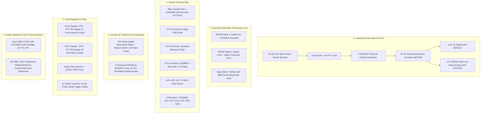

# Hydroponics Platform — Custom All-in-One PCB Design & Engineering Specification

**Document Version:** 1.0.0  
**Target Audience:** PCB Layout Designer & Hardware Engineers  
**Target CAD Suites:** EasyEDA (Standard/Pro), KiCad 8, or Altium Designer  
**Target Fabrication:** Standard 2-Layer FR-4 (1.6mm thickness, 1oz copper, Green/Black/Blue solder mask) via JLCPCB or PCBWay  
**Board Dimensions:** $100\text{ mm} \times 100\text{ mm}$ (Standard Eurorack / Standoff compatible with 4x M3 mounting holes at $4\text{ mm}$ offset)

---

## 1. System Overview & Board Architecture

This specification defines a modular, industrial-grade **All-in-One Hydroponics Controller Motherboard**. The PCB consolidates dual ESP32 microcontrollers, dual 1.8" color display ribbon ports, isolated sensor frontends (including an onboard BNC pH amplifier), optoisolated 10A relay switching, and 4-channel PWM peristaltic dosing drivers onto a single rigid board.



---

## 2. Complete Component Bill of Materials (BOM)

### 2.1 Microcontrollers & Programming
| Designator | Description / Part # | Package / Footprint | Qty | Function & Purpose |
|---|---|---|---|---|
| `U1`, `U2` | **ESP32-WROOM-32E** (or dual 30-pin DIP sockets) | SMD Module / 2.54mm Socket | 2 | Node 1 (Climate/Flow/Pump) and Node 2 (Chemistry/pH/Dosing) |
| `U3`, `U4` | **CP2102N-A02** or **CH340C** | QFN-24 / SOP-16 | 2 | USB-to-UART bridge controllers for flashing & gateway serial |
| `J1`, `J2` | **USB-C 16-Pin Female** | SMD Type-C Receptacle | 2 | Dual USB-C ports for Raspberry Pi 5 gateway connection |
| `C_U1–C_U4` | 0.1µF (100nF) 50V X7R | 0805 SMD | 4 | High-frequency bypass decoupling capacitors |

---

### 2.2 Power Supply & Protection
| Designator | Description / Part # | Package / Footprint | Qty | Function & Purpose |
|---|---|---|---|---|
| `J_PWR` | **5.5×2.1mm DC Barrel Jack** + 2P 5.08mm Screw TB | THT / Screw Terminal | 1 | 9V–24V DC Main external power input |
| `Q_PWR` | **AO3401A** (P-Channel MOSFET, 30V 4.2A) | SOT-23 | 1 | Zero-voltage-drop reverse polarity protection |
| `F1` | **5.0A 30V Resettable PTC Fuse** | 1812 SMD | 1 | Over-current protection on main DC bus |
| `D_TVS` | **SMAJ24A** (24V Unidirectional TVS) | SMA (DO-214AC) | 1 | Clamps transient voltage spikes and inductive surge |
| `U_BUCK` | **MP1584EN** or **TPS5430** (Step-Down Buck IC) | SOIC-8 | 1 | Steps down 9V–24V to stable 5.0V @ 3.0A |
| `L1` | **10µH – 22µH 3.5A Shielded Inductor** | 6×6mm / 7×7mm SMD | 1 | High-efficiency buck power inductor |
| `U_LDO1` | **AMS1117-3.3** (3.3V 1.0A Linear Regulator) | SOT-223 | 1 | 5V $\rightarrow$ 3.3V Digital Logic Rail (`+3V3_DIG`) |
| `U_LDO2` | **AP2112K-3.3** (3.3V 600mA Ultra-Low-Noise LDO) | SOT-23-5 | 1 | 5V $\rightarrow$ 3.3V Clean ADC Rail for pH/TDS (`+3V3_ANA`) |
| `C_IN`, `C_OUT`| **100µF 35V Low-ESR Electrolytic** | 6.3×11mm Radial / SMD | 2 | Primary bulk filtering capacitors |
| `C_FILT` | **10µF 25V X7R Ceramic** | 0805 SMD | 6 | Local LDO and Buck input/output filter capacitors |

---

### 2.3 Analog Front-End (pH & Chemistry Front-End)
| Designator | Description / Part # | Package / Footprint | Qty | Function & Purpose |
|---|---|---|---|---|
| `J_BNC` | **Right-Angle PCB Female BNC Connector** | BNC-THT-RA | 1 | Standard coaxial socket for glass bulb pH electrode |
| `U_PH` | **LMC6482** or **TL082** (Ultra-Low Bias Dual Op-Amp)| SOIC-8 | 1 | High-impedance ($10^{12}\Omega$) buffer & scaling amplifier |
| `RV1` | **10kΩ 3296W Multi-Turn Cermet Trimmer** | 3296W Top-Adjust | 1 | Neutral voltage calibration offset trimmer ($1.65\text{V}$) |
| `R_PH1–R_PH6`| 100kΩ, 10kΩ, 1kΩ (1% Metal Film Precision) | 0805 SMD | 6 | Op-amp non-inverting feedback & reference dividers |
| `C_PH1` | 100nF (0.1µF) 50V C0G/NPO | 0805 SMD | 2 | Low-pass anti-aliasing filter capacitor for pH ADC |

---

### 2.4 Actuation, Relays & Peristaltic Dosing Drivers
| Designator | Description / Part # | Package / Footprint | Qty | Function & Purpose |
|---|---|---|---|---|
| `K1` | **Songle SRD-05VDC-SL-C** (10A 250VAC Relay) | THT 5-Pin Relay | 1 | Main 12V submersible pump mechanical dry-contact switch |
| `U_OPTO` | **PC817 / EL817 Optocoupler** | DIP-4 / SOP-4 | 1 | Optical isolation separating ESP32 from relay coil noise |
| `Q_RELAY` | **MMBT2222A** (NPN Transistor, 40V 600mA) | SOT-23 | 1 | Relay coil low-side switch |
| `D1–D5` | **1N4007** or **SS14 Schottky** | SOD-123 / SMA | 5 | Flyback clamp diodes across relay coil & 4 dosing pumps |
| `Q1–Q4` | **AO3400A** (N-Channel MOSFET, 30V 5.7A, $R_{DS(on)} < 28\text{m}\Omega$) | SOT-23 | 4 | PWM low-side drivers for 4x 12V Peristaltic Dosing Pumps |
| `R_G1–R_G4`| 100Ω Gate Resistors (0805) + 10kΩ Pull-downs | 0805 SMD | 8 | MOSFET gate damping and fail-safe pull-downs |
| `LED_ACT` | 0805 SMD LEDs (Red: Relay, Yellow: 4x Dosing Pumps)| 0805 SMD | 5 | Visual indicator LEDs showing active actuation |

---

### 2.5 Terminal Blocks, Connectors & User Interface
| Designator | Description / Part # | Package / Footprint | Qty | Function & Purpose |
|---|---|---|---|---|
| `TB_RELAY` | 2-Pin 5.08mm Pluggable Screw Terminal | 5.08mm Pitch TB | 1 | High-current relay COM / NO contacts for main pump |
| `TB_DOSE` | 2-Pin 3.81mm Screw Terminals (4 Blocks) | 3.81mm Pitch TB | 4 | Terminals for Dosing Pumps (pH Down, pH Up, Nut A, Nut B) |
| `TB_SENS` | 3-Pin 3.81mm Pluggable Screw Terminals | 3.81mm Pitch TB | 3 | Screw terminals for TDS Probe, Moisture Probe, DS18B20 Temp |
| `J_FLOW` | 3-Pin JST-XH (2.50mm Pitch) | JST-XH-3A | 1 | Locking connector for YF-S201 Flow Sensor (5V, GND, Pulse) |
| `J_I2C` | 4-Pin JST-SH (1.00mm Pitch) Qwiic / STEMMA QT | JST-SH-4A | 1 | I2C Expansion Port (3.3V, GND, SDA, SCL) for ToF Level / CO₂ |
| `J_DISP1`, `J_DISP2`| 1×8 Pin 2.54mm Shrouded Header (or 8-Pin FPC) | 2.54mm / FPC | 2 | VSPI connectors for Dual ST7735 1.8" TFT Displays |
| `BZ1` | 5V Continuous Active Piezo Buzzer (12mm) | 12mm THT Pitch 7.6mm| 1 | Audible safety alarm & boot fanfare |
| `Q_BUZZ` | **BC547 / MMBT3904** NPN Transistor | SOT-23 | 1 | Buzzer driver switch (Base driven via 1kΩ from GPIO 25) |
| `SW1–SW3` | 6×6mm SMD Tactile Pushbuttons | 6×6×5mm SMD | 3 | Manual Pump Prime, Mode Toggle, Reset Fault |
| `FB1` | **0805 Ferrite Bead (600Ω @ 100MHz)** | 0805 SMD | 1 | Star-point link tying Analog GND ($AGND$) to Digital GND ($DGND$) |

---

# 🔌 3. Master Point-to-Point Netlist & Routing

```text
┌─────────────────────────────────────────────────────────────────────────────┐
│                          ESP32-1 (NODE 1: esp32-env)                        │
│                  CLIMATE, FLUID DYNAMICS, ACTUATION & UI                    │
├─────────────────┬───────────────────┬───────────────────────────────────────┤
│ ESP32 Pin       │ Connected Net     │ Hardware Circuit / Terminal Block     │
├─────────────────┼───────────────────┼───────────────────────────────────────┤
│ GPIO 4          │ NET_DHT11_DATA    │ 3-Pin Header Pin 2 (with 10kΩ to 3V3) │
│ GPIO 13 (ISR)   │ NET_FLOW_PULSE    │ J_FLOW Pin 3 (YF-S201 Pulse Line)     │
│ GPIO 27         │ NET_DS18B20_1WIRE │ 3-Pin TB Pin 2 (with 4.7kΩ to 3V3)    │
│ GPIO 26         │ NET_RELAY_TRIGGER │ PC817 Optocoupler Anode (Active LOW)  │
│ GPIO 25         │ NET_BUZZER_CTRL   │ BC547 Base via 1kΩ Resistor           │
│ GPIO 18 (SCK)   │ NET_SPI_SCK_1     │ J_DISP1 Pin 3 (Display #1 SCL)        │
│ GPIO 23 (MOSI)  │ NET_SPI_MOSI_1    │ J_DISP1 Pin 4 (Display #1 SDA)        │
│ GPIO 16 (DC)    │ NET_SPI_DC_1      │ J_DISP1 Pin 6 (Display #1 DC/A0)      │
│ GPIO 17 (RST)   │ NET_SPI_RST_1     │ J_DISP1 Pin 5 (Display #1 RES)        │
│ GPIO 5 (CS)     │ NET_SPI_CS_1      │ J_DISP1 Pin 7 (Display #1 CS)         │
│ GPIO 32         │ NET_BTN_PRIME     │ SW1 (Normally Open to DGND)           │
│ GPIO 33         │ NET_BTN_MODE      │ SW2 (Normally Open to DGND)           │
│ 3V3 (Power Out) │ +3V3_DIG          │ Digital Logic Power Rail              │
│ GND (Ground)    │ DGND              │ Digital Ground Plane                  │
└─────────────────┴───────────────────┴───────────────────────────────────────┘

┌─────────────────────────────────────────────────────────────────────────────┐
│                          ESP32-2 (NODE 2: esp32-chem)                       │
│                  WATER CHEMISTRY, AUTO-DOSING & COCKPIT 2                   │
├─────────────────┬───────────────────┬───────────────────────────────────────┤
│ ESP32 Pin       │ Connected Net     │ Hardware Circuit / Terminal Block     │
├─────────────────┼───────────────────┼───────────────────────────────────────┤
│ GPIO 34 (ADC1_6)│ NET_PH_ANALOG_OUT │ LMC6482 Op-Amp Output Pin 1 (0.0-3.3V)│
│ GPIO 35 (ADC1_7)│ NET_TDS_ANALOG_OUT│ 3-Pin TDS TB Pin 2 (0.0-2.3V ADC)     │
│ GPIO 32 (ADC1_4)│ NET_MOIST_OUT     │ 3-Pin Moisture TB Pin 2 (0.0-3.3V ADC)│
│ GPIO 21 (SDA)   │ NET_I2C_SDA       │ J_I2C Qwiic Pin 3 (with 4.7kΩ pullup) │
│ GPIO 22 (SCL)   │ NET_I2C_SCL       │ J_I2C Qwiic Pin 4 (with 4.7kΩ pullup) │
│ GPIO 12 (PWM)   │ NET_DOSE1_GATE    │ MOSFET Q1 Gate via 100Ω (pH Down)     │
│ GPIO 14 (PWM)   │ NET_DOSE2_GATE    │ MOSFET Q2 Gate via 100Ω (pH Up)       │
│ GPIO 27 (PWM)   │ NET_DOSE3_GATE    │ MOSFET Q3 Gate via 100Ω (Nutrient A)  │
│ GPIO 13 (PWM)   │ NET_DOSE4_GATE    │ MOSFET Q4 Gate via 100Ω (Nutrient B)  │
│ GPIO 18 (SCK)   │ NET_SPI_SCK_2     │ J_DISP2 Pin 3 (Display #2 SCL)        │
│ GPIO 23 (MOSI)  │ NET_SPI_MOSI_2    │ J_DISP2 Pin 4 (Display #2 SDA)        │
│ GPIO 16 (DC)    │ NET_SPI_DC_2      │ J_DISP2 Pin 6 (Display #2 DC/A0)      │
│ GPIO 17 (RST)   │ NET_SPI_RST_2     │ J_DISP2 Pin 5 (Display #2 RES)        │
│ GPIO 5 (CS)     │ NET_SPI_CS_2      │ J_DISP2 Pin 7 (Display #2 CS)         │
│ 3V3 (Power Out) │ +3V3_ANA          │ Clean Analog ADC Power Rail           │
│ GND (Ground)    │ AGND              │ Isolated Analog Ground Plane          │
└─────────────────┴───────────────────┴───────────────────────────────────────┘
```

---

## 4. PCB Layout & Routing Guidelines (Intermediate Level)

### 4.1 Ground Plane Strategy (Star Ground via Ferrite Bead)
- **Digital Ground ($DGND$)**: Covers the right/center portion of the board containing the ESP32 digital lines, Buck converter switching node, Relay, and MOSFET drivers.
- **Analog Ground ($AGND$)**: A solid, uninterrupted ground copper pour restricted exclusively underneath the BNC connector, Op-Amp chip (`U_PH`), and TDS terminal.
- **Star Connection**: $AGND$ and $DGND$ must **NOT** overlap. They connect together at a single point right next to the power input using an **0805 Ferrite Bead (`FB1`)**.

```text
  [ AGND (Quiet Analog Zone) ]                      [ DGND (Noisy Digital Zone) ]
  BNC / Op-Amp / Analog Sensors                   ESP32 / Buck / Relays / MOSFETs
              │                                                 │
              └───────────────────[ FB1: Ferrite Bead ]─────────┘
                                           │
                                    [ Common GND ]
```

### 4.2 Trace Widths & Current Capacity
| Net / Signal Type | Recommended Trace Width | Clearance / Spacing | Copper Layer |
|---|---|---|---|
| **12V High-Current Pump Bus** | $2.5\text{ mm}$ ($100\text{ mil}$) or Polygon Pour | $0.5\text{ mm}$ ($20\text{ mil}$) | Top & Bottom |
| **5.0V Buck Output Rail** | $1.2\text{ mm}$ ($48\text{ mil}$) | $0.3\text{ mm}$ ($12\text{ mil}$) | Top / Bottom |
| **3.3V Logic & Analog Rails** | $0.8\text{ mm}$ ($32\text{ mil}$) | $0.25\text{ mm}$ ($10\text{ mil}$) | Top |
| **High-Speed SPI & I2C Signals**| $0.25\text{ mm}$ ($10\text{ mil}$) | $0.25\text{ mm}$ ($10\text{ mil}$) | Top |
| **BNC pH Analog Input Trace** | $0.4\text{ mm}$ (Surrounded by AGND guard) | $0.3\text{ mm}$ ($12\text{ mil}$) | Top (Shortest possible $< 15\text{ mm}$) |

### 4.3 Decoupling Capacitor Placement Rule
- Place every $0.1\mu\text{F}$ capacitor within **$3\text{ mm}$** of the associated IC's VCC pin with direct, low-impedance vias to the ground plane.

### 4.4 Silkscreen & Labeling Requirements
- **Terminal Pinouts**: Clearly print `+`, `-`, and `SIG` next to every 3-pin sensor terminal.
- **Relay Markings**: Print `12V PUMP: COM / NO` in large bold silkscreen text.
- **Dosing Channels**: Label MOSFET terminals clearly: `DOSE 1: pH-`, `DOSE 2: pH+`, `DOSE 3: NUT-A`, `DOSE 4: NUT-B`.
- **Displays**: Label header pins `1:GND`, `2:VCC`, `3:SCL`, `4:SDA`, `5:RST`, `6:DC`, `7:CS`, `8:BLK`.

---

## 5. EDA Workflow & Fabrication Guide

### Step 1: Schematic Capture in EasyEDA / KiCad
1. Create schematic sheets corresponding to the 6 functional zones.
2. Search components by LCSC part numbers listed in the BOM table to auto-import pre-verified 3D footprints.
3. Use net labels (`NET_...`) to connect signals without messy crossing wires.

### Step 2: PCB Placement & Board Outline
1. Draw a **$100\text{ mm} \times 100\text{ mm}$** rectangular board outline on the `Edge.Cuts` layer.
2. Place four **M3 mounting holes ($3.2\text{ mm}$ diameter, $6.0\text{ mm}$ pad)** at $4\text{ mm}$ offset from each corner.
3. Place all connectors and screw terminals along the outer edges facing outward.

### Step 3: Design Rule Check (DRC)
Verify against standard fab limits:
- Minimum Trace Width: `0.15 mm` (6 mil)
- Minimum Trace Clearance: `0.15 mm` (6 mil)
- Minimum Via Diameter: `0.6 mm` (0.3 mm drill)

### Step 4: Export for Fabrication
Export from EDA:
1. **Gerber Files** (ZIP archive with RS-274X layers).
2. **BOM File** (`.csv` format for JLCPCB SMT automated assembly).
3. **CPL / Centroid File** (`.csv` pick-and-place component coordinates).
