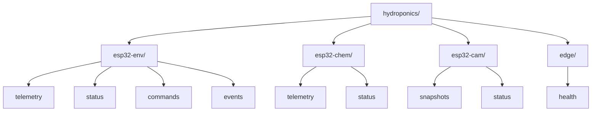

# Hydroponics Platform — MQTT Topics & Messaging Specification

## 1. MQTT Topic Hierarchy Architecture

The platform uses a standardized, hierarchical MQTT topic structure under the `hydroponics/` root namespace.



---

## 2. Topic Definitions & Payload Roles

| Topic String | Publisher | Subscriber | QoS | Retain | Content / Purpose |
|---|---|---|---|---|---|
| `hydroponics/esp32-env/telemetry` | Edge Gateway | Backend | 0 | False | Node 1 telemetry: air temp, humidity, flow rate, water volume, pump state |
| `hydroponics/esp32-chem/telemetry`| Edge Gateway | Backend | 0 | False | Node 2 telemetry: solution pH, TDS, substrate moisture |
| `hydroponics/+/status` | Device / LWT | Backend | 1 | True | Node online/offline state & LWT payload (`{"status":"OFFLINE"}`) |
| `hydroponics/esp32-env/commands` | Backend | Edge Gateway | 1 | False | Remote actuation commands (`{"action":"SET_STATE", "value":"ON"}`) |
| `hydroponics/esp32-env/events` | Node 1 / Gateway | Backend | 1 | False | Safety events & alarms (Dry-run lockout, heat stress) |
| `hydroponics/edge/health` | Edge Gateway | Backend / UI | 0 | False | Edge host CPU %, RAM %, and offline pending buffer count |

---

## 3. Remote Actuator Command Schema

Published by Backend to `hydroponics/esp32-env/commands`:

```json
{
  "commandId": "cmd-827419",
  "deviceId": "esp32-env",
  "actuatorId": "pump-01",
  "action": "SET_STATE",
  "value": "ON",
  "issuedAt": "2026-08-17T18:30:00Z"
}
```

Dispatched to ESP32 serial bridge as character command `1`.